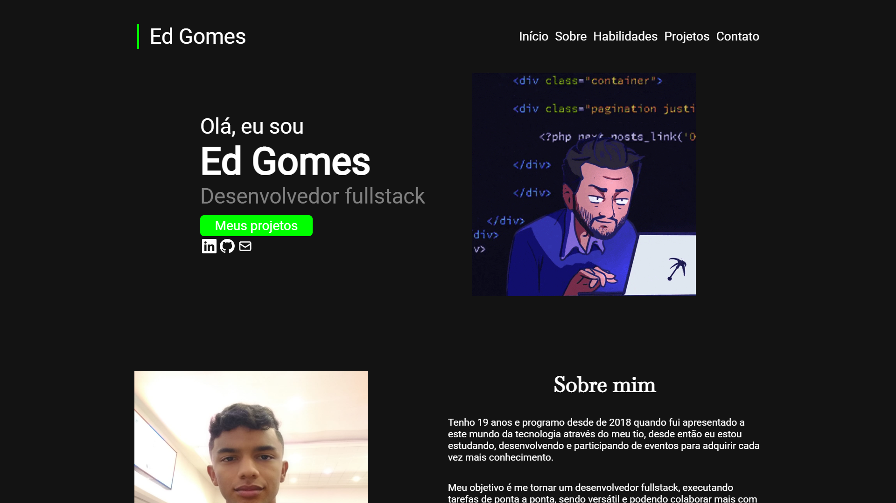
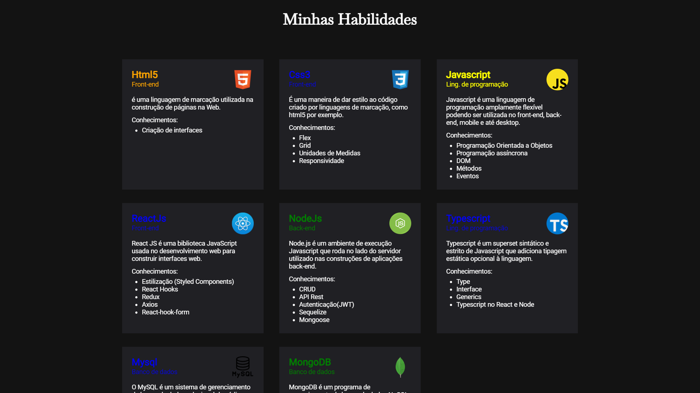
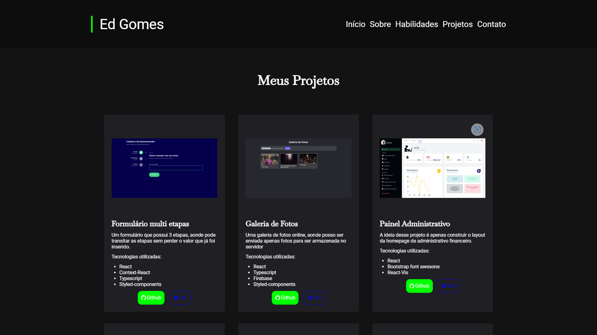

# Portifólio

# Imagens do projeto

  
  
  

# Informações

- Meu portifólio para demonstrar minhas habilidades.

# Construido com:

- ReactJS: Para montrar a interface gráfica.
- React-hook-form: Para criar o formulário.
- Yup: Para validar o formulário.
- React-icons: Provendo icones para aplicação.
- Styled-components: Para estilizar o projeto com css.
- Eslint e Prettier: Para manter um código organizado e limpo.
